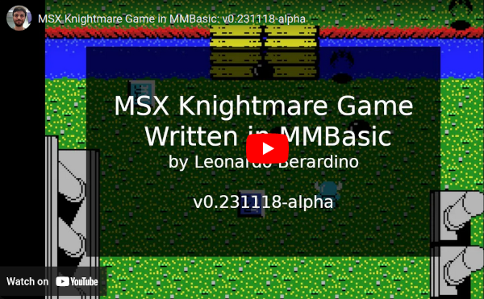

# Knightmare MMBasic Version

The MSX Knightmare video game entirely written in MMBasic.

**This version is still in development!**

## MSX Knightmare

Knightmare is a 1986 vertically scrolling shooter video game developed and published by Konami for the MSX home computer.

For more about the video game, [Knightmare on Wikipedia](https://en.wikipedia.org/wiki/Knightmare_(1986_video_game))

## MMBasic

MMBasic is a free, fast and open BASIC interpreter for microcontrollers.

It includes floating point numbers, extensive string handling, multi-dimensional arrays, and structured programming features like do loops, multiline if statements, user-defined subroutines, and functions.

See more at the [MMBasic home page](https://mmbasic.com/)

## MMBasic for Windows

The Windows/DOS version of MMBasic was created to make it easy to evaluate MMBasic. It is a single executable that does not need installation, just double-click on the executable and MMBasic will run in a DOS window on Windows (including Windows 10). It also runs in Linux using [Wine](https://www.winehq.org/).

The executable and documentation can be downloaded from [https://www.thebackshed.com/forum/uploads/matherp/2023-12-24_033644_MMBasic.zip](https://www.thebackshed.com/forum/uploads/matherp/2023-12-24_033644_MMBasic.zip).

## Running MMBasic Knightmare

After downloading the source code from this repository and executing the MMBasic, you will need to access the directory where the **Knightmare** is located using the command ```chdir "dir/for/the/game"```. You can also use the command ```files``` to list the directory content.

To run the video game use the command ```run "km.bas"```

[](https://youtube.com/playlist?list=PLpx1nOk-DRHy_u9RyLZ5AYdjwFX-UcOje&si=Dn6mccseqbJvQ2Kn "MMBasic Knightmare")

## Maps

Knightmare has a total of 8 different stages, each with its map. The maps were designed using the [Tiled map editor](https://www.mapeditor.org/), a powerful open-source tool for creating video game maps.

<image alt="Tiled" src="images/tiled.png" width="600px" style="margin-bottom: 20px;"/>

I created a [nodejs script](/blob/main/dev/map_converter.js) that converts the exported json map to the binary format used by the game engine.

The binary format is very simple:

```
2 Bytes per tile
0000 0000 0000 0000
|  |      ||-------> 7 bits: Tile Id
|  |      |--------> 1 bit : Solid bit
|  |---------------> 5 bits: Objects, enemies, power-ups
|------------------> 3 bits: Object properties
```

## Original MSX Knightmare Screenshots

<div style="display: flex; gap: 20px;">
    <image alt="Konami Logo Screen" src="images/screen01.png" width="250px"/>
    <image alt="Video Game Menu Screen" src="images/screen02.png" width="250px"/>
    <image alt="Stage 1 Screen" src="images/screen03.png" width="250px"/>
</div>
